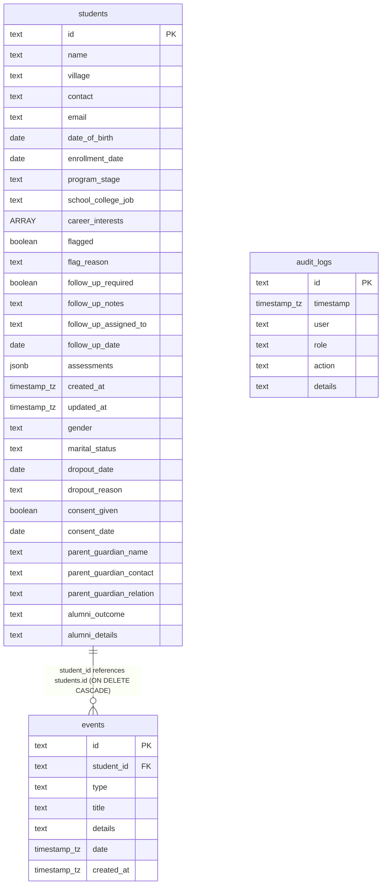

# Ekayan Bridge — Database Schema & Relations (Verified Live)

This document outlines the verified relational database design and exact column details for the Ekayan Student Dashboard, extracted directly from the live Supabase (PostgreSQL) database.

---

## 1. Database Relations Diagram

---

## 2. Table Column Specifications (Live Reference)

### `students` Table
Stores student enrollment records, career tracking, demographic statistics, and compliance metadata.

| Column Name | Data Type | Nullable | Column Default / Constraints | Description |
| :--- | :--- | :--- | :--- | :--- |
| `id` | `text` | NO | *None (Primary Key)* | Unique student ID (format: `CF-2026-XXXX`) |
| `name` | `text` | NO | *None* | Full name of the student |
| `village` | `text` | YES | `null` | Village name for geographic statistics |
| `contact` | `text` | YES | `null` | Student mobile number (masked for Staff role) |
| `email` | `text` | YES | `null` | Email address (masked for Staff role) |
| `date_of_birth` | `date` | YES | `null` | Used to calculate age and check minor status |
| `enrollment_date` | `date` | NO | *None* | Date of registration |
| `program_stage` | `text` | NO | `'enrolled'::text` | e.g. `enrolled`, `neev`, `disha`, `nirmaan`, `sampark` (Alumni), `dropped_out` |
| `school_college_job`| `text` | YES | `null` | Details on active school/college or employment |
| `career_interests` | `ARRAY` | YES | `null` | List of student career interests |
| `flagged` | `boolean` | YES | `false` | Student attention flagging status |
| `flag_reason` | `text` | YES | `null` | Reason why a student is flagged |
| `follow_up_required` | `boolean` | YES | `false` | If student needs guidance/follow-up |
| `follow_up_notes` | `text` | YES | `null` | Specific context/notes for follow-up |
| `follow_up_assigned_to`| `text` | YES | `null` | Target staff member's email address |
| `follow_up_date` | `date` | YES | `null` | Target resolution date |
| `created_at` | `timestamp with tz` | NO | `timezone('utc'::text, now())` | Record creation timestamp |
| `updated_at` | `timestamp with tz` | NO | `timezone('utc'::text, now())` | Record modification timestamp |
| `assessments` | `jsonb` | YES | `'[]'::jsonb` | Array containing scores, types, and attachments |
| `gender` | `text` | YES | `'prefer_not_to_say'::text` | Demographics: `male`, `female`, `other` |
| `marital_status` | `text` | YES | `'prefer_not_to_say'::text` | Demographics: `single`, `married`, `divorced` |
| `dropout_date` | `date` | YES | `null` | Logged if stage changes to `dropped_out` |
| `dropout_reason` | `text` | YES | `''::text` | Reason for drop out (e.g. `financial`, `academic`) |
| `consent_given` | `boolean` | YES | `false` | DPDP privacy compliance signed checkbox state |
| `consent_date` | `date` | YES | `null` | Date the privacy consent was agreed to |
| `parent_guardian_name`| `text` | YES | `null` | Required for minor students (< 18 yrs) |
| `parent_guardian_contact`| `text` | YES | `null` | Parent contact number for minor students |
| `parent_guardian_relation`| `text` | YES | `'parent'::text` | Parent relationship type (e.g. `parent`, `mother`, `father`) |
| `alumni_outcome` | `text` | YES | `null` | Placement category (e.g. `Employed (Organised)`) |
| `alumni_details` | `text` | YES | `null` | Description/details of alumni job or higher education |

---

### `events` Table
Tracks student interaction logs, counselor sessions, and activity history.

| Column Name | Data Type | Nullable | Column Default / Constraints | Description |
| :--- | :--- | :--- | :--- | :--- |
| `id` | `text` | NO | `gen_random_uuid()` *(Primary Key)* | Unique event ID (UUID) |
| `student_id` | `text` | NO | *None (Foreign Key)* | References `students(id)` with `ON DELETE CASCADE` |
| `type` | `text` | NO | *None* | Type of event (e.g. `stage_change`, `notes`) |
| `title` | `text` | NO | *None* | Heading of the log item |
| `details` | `text` | YES | `null` | Description text |
| `date` | `timestamp with tz` | NO | *None* | Target timestamp of the activity |
| `created_at` | `timestamp with tz` | NO | `timezone('utc'::text, now())` | Record creation timestamp |

---

### `audit_logs` Table
Maintains compliance logs of administrative operations for auditing purposes.

| Column Name | Data Type | Nullable | Column Default / Constraints | Description |
| :--- | :--- | :--- | :--- | :--- |
| `id` | `text` | NO | *None (Primary Key)* | Unique audit ID |
| `timestamp` | `timestamp with tz` | NO | `timezone('utc'::text, now())` | Timing of action |
| `user` | `text` | NO | *None* | Email of the user performing the action |
| `role` | `text` | NO | *None* | Role of the user (`staff` or `admin`) |
| `action` | `text` | NO | *None* | Operation type (e.g. `ADD_STUDENT`) |
| `details` | `text` | YES | `null` | Summary of fields modified |
